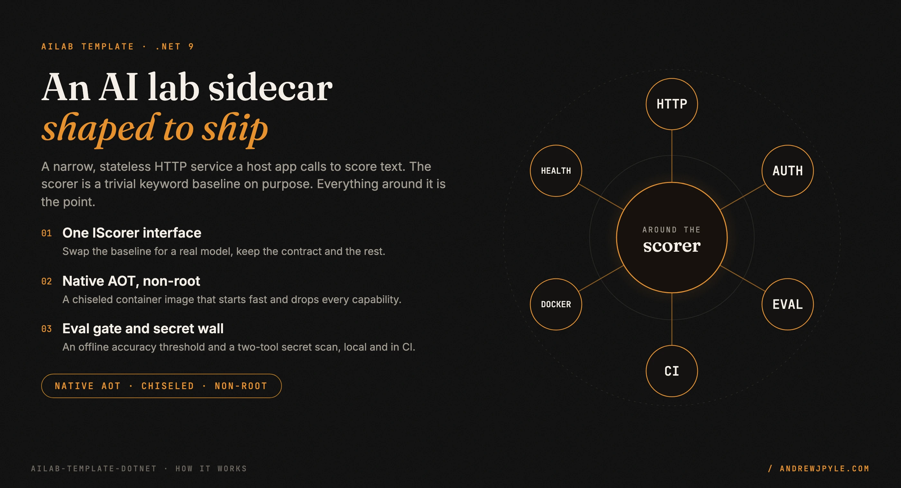
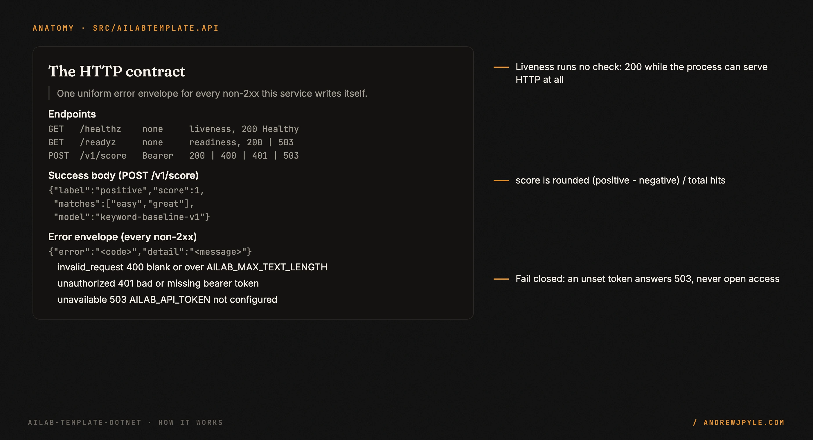
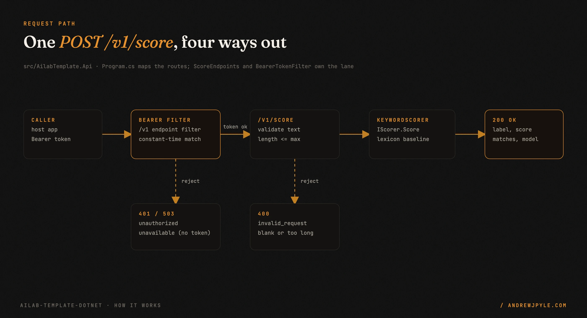
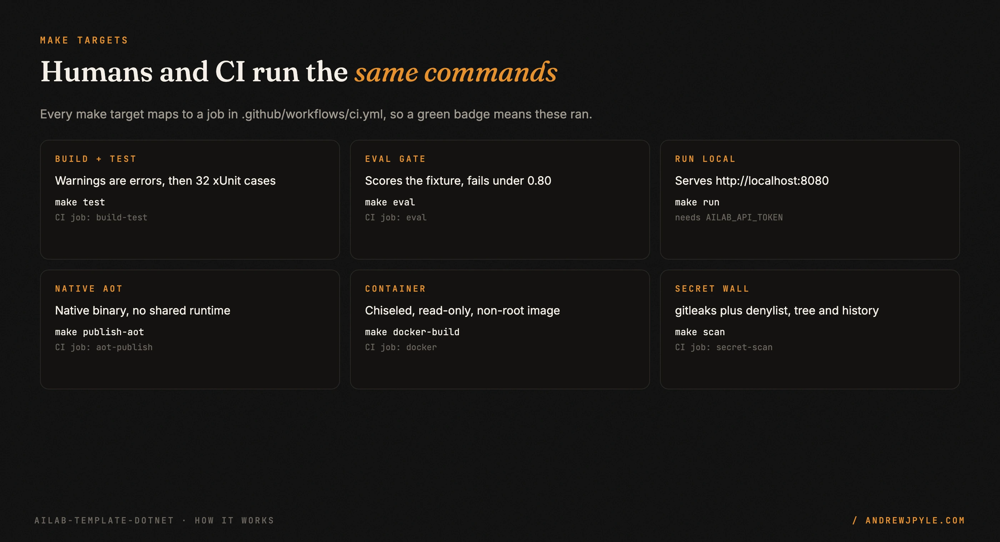

<p align="center">
  
</p>

<p align="center">
  <a href="https://github.com/andrewjpyle/ailab-template-dotnet/actions/workflows/ci.yml"></a>
  
  
  
</p>

# A production-shaped template for AI lab sidecars in C#

Most "AI service" starters give you a model wrapper and leave the hard half to you: the HTTP
contract, the auth, the health probes, the config, the eval gate, the container, and the secret
hygiene. This template is the hard half. The scoring logic is a deliberately trivial keyword
baseline. The point is everything around it, and a real lab swaps in a model behind the same
`IScorer` interface and keeps the rest.

- **A narrow HTTP contract.** `POST /v1/score` behind a bearer gate, `/healthz` and `/readyz`
  probes, and one uniform error envelope for every non-2xx the service writes.
- **Native AOT in a chiseled, non-root container.** No shared .NET runtime at run time; the image
  drops every Linux capability and mounts read-only.
- **An offline eval gate.** `make eval` scores a committed fixture and fails the build when
  accuracy falls below a threshold, so a regression stops a merge.
- **A two-tool secret wall.** gitleaks plus a denylist scan, over the tree and full history, run in
  the pre-push hook and again in CI, and the denylist fails closed.

> **The one idea worth stealing, even if you never run this code:** a sidecar with one caller needs
> a gate, not an identity system. A single bearer token checked in constant time, that fails closed
> when it is unset, is the right amount of auth here. "No token configured" returns 503, never open
> access. Adding OAuth and roles to a one-caller service is cost with no reader.

---

## 60 seconds to a scored request

Requires the .NET 9 SDK (pinned by `global.json`), `make`, and optionally Docker and gitleaks.

```bash
make test                                   # build (warnings are errors) + 32 xUnit cases
make eval                                   # offline eval gate, writes eval_results.json
export AILAB_API_TOKEN="$(openssl rand -hex 32)"
make run                                    # http://localhost:8080
```

```bash
curl -s localhost:8080/healthz
curl -s -X POST localhost:8080/v1/score \
  -H "Authorization: Bearer $AILAB_API_TOKEN" -H "Content-Type: application/json" \
  -d '{"text":"Setup was easy and support was great."}'
# {"label":"positive","score":1,"matches":["easy","great"],"model":"keyword-baseline-v1"}
```

The score is `(positive - negative) / (positive + negative)` over lexicon hits, rounded to four
places. `"easy"` and `"great"` are both positive hits, so the score is 1.

<p align="center"></p>

Native AOT and container:

```bash
make publish-aot                            # native binary in artifacts/publish/<rid>/
make docker-build                           # multi-stage AOT build, chiseled runtime image
docker compose up --build                   # reads AILAB_API_TOKEN from your shell
```

On macOS with Homebrew's .NET, AOT links against Homebrew OpenSSL and Brotli; the Makefile adds
their library paths. Xcode Command Line Tools are required for the native linker.

## Endpoints

| Method | Path | Auth | Purpose | Responses |
|---|---|---|---|---|
| GET | `/healthz` | none | Liveness: the process can serve HTTP | `200 Healthy` |
| GET | `/readyz` | none | Readiness: started and not shutting down | `200 Healthy`, `503 Unhealthy` |
| POST | `/v1/score` | Bearer | Score `{"text": "..."}` | `200`, `400` invalid input, `401` bad/missing token, `503` token not configured |

Errors use one envelope: `{"error": "<code>", "detail": "<message>"}`. The codes are
`invalid_request` (400), `unauthorized` (401), and `unavailable` (503).

## Configuration

Environment variables only; there is no `appsettings.json`.

| Variable | Default | Meaning |
|---|---|---|
| `AILAB_API_TOKEN` | unset | Shared bearer token. If unset, `/v1/*` fails closed with 503 and a warning is logged at startup. |
| `AILAB_MAX_TEXT_LENGTH` | `4096` | Maximum characters accepted by `/v1/score` (1 to 100000). |
| `AILAB_SHUTDOWN_TIMEOUT_SECONDS` | `20` | Graceful-shutdown budget for in-flight requests (1 to 300). |
| `PORT` | `8080` | Listen port on `0.0.0.0`, used when `ASPNETCORE_URLS` is not set. |
| `ASPNETCORE_URLS` | unset | Full listen URL(s); overrides `PORT`. |
| `Logging__LogLevel__Default` | `Information` | Standard .NET logging levels (JSON lines on stdout). |

Invalid values stop the process at startup (options are validated on start, not on first use).

## How it works

<p align="center"></p>

A request to `POST /v1/score` takes one of four ways out. The `/v1` group runs a `BearerTokenFilter`
first: an unset token returns `503 unavailable`, a bad or missing token returns `401 unauthorized`,
and a valid token lets the request through. The endpoint then validates the body: blank text or text
over `AILAB_MAX_TEXT_LENGTH` returns `400 invalid_request`. Only then does the `KeywordScorer` (an
`IScorer`) run and return `200` with the label, score, matches, and model name. The scorer lives in
`AilabTemplate.Core` with no ASP.NET dependency, so it stays AOT-compatible and unit-testable on its
own. The token comparison is constant-time over SHA-256 hashes, so neither the value nor its length
leaks through timing.

The same `make` targets run locally and in CI, so there is no drift between your machine and the
pipeline. Each target maps to a named job in `.github/workflows/ci.yml`.

<p align="center"></p>

## Scope: what it does not do

- **It is not a model.** The baseline ignores negation and sarcasm on purpose, and the eval fixture
  includes such rows so the ceiling is visible. Replace `KeywordScorer`, keep the contract.
- **It is not an identity system.** One shared bearer token, no users, roles, or OAuth. A sidecar
  with one caller needs a gate.
- **It is not multi-tenant and holds no state.** No database, no sessions, no request log beyond the
  JSON lines on stdout.
- **It does not call out.** No outbound network, no telemetry, no model download at run time.

## The patterns

| Pattern | The failure it prevents |
|---|---|
| Fail closed when the token is unset | A missing config silently opening a protected endpoint to everyone |
| Constant-time token compare over hashes | Leaking the token, or its length, through response timing |
| `IScorer` seam in a no-ASP.NET core project | A model swap dragging in the web stack and breaking AOT |
| Eval gate that exits non-zero under threshold | An accuracy regression merging because nothing checked it |
| Same `make` targets for humans and CI | "Works on my machine" drift between local and the pipeline |
| Secret wall over full history, failing closed | A rotated secret still sitting in a past commit, or a clean scan that only looked at the tree |
| Options validated at startup | A bad limit or timeout surfacing as a confusing failure on the first request |

## FAQ

**Why a keyword baseline instead of a real model?** So the HTTP contract, the tests, and the eval
gate are real from day one and independent of any model choice. You replace one class.

**Why Native AOT?** A small, fast-starting, single-file binary with no shared runtime, which is what
makes the chiseled non-root image small. The build and publish treat trimming and AOT warnings as
errors, so the swap-in model has to stay AOT-safe too.

**Why environment variables and no `appsettings.json`?** Twelve-factor config, one source of truth,
and validation at startup. The defaults live in code underneath every other source, so any variable
still overrides them.

**Does the eval gate need a network or a key?** No. It runs the scorer over a committed, synthetic
fixture offline and writes `eval_results.json`. See [FIXTURES.md](FIXTURES.md).

## Eval results

`make eval` (and the CI `eval` job) runs the scorer over `fixtures/score_eval.jsonl`, writes
`eval_results.json`, prints the row to paste here, and exits non-zero if accuracy falls below the
threshold (0.80). CI uploads the file as the `eval-results` artifact.

| Date | Commit | Model/Provider | Dataset | Metric | Score | Notes |
|---|---|---|---|---|---|---|
| 2026-10-01 | 8a19893 | keyword-baseline-v1 / baseline | score_eval.jsonl (n=40) | accuracy | 0.900 | threshold 0.80; misses: syn-036, syn-037, syn-038, syn-039 (negation, sarcasm, no lexicon hit) |

`eval_results.json` contract (`schema_version` 1; extra keys allowed, required keys never renamed):

```json
{
  "schema_version": 1,
  "lab": "ailab-template-dotnet",
  "dataset": "score_eval.jsonl",
  "provider": "baseline",
  "model": "keyword-baseline-v1",
  "primary_metric": "accuracy",
  "metrics": { "accuracy": 0.9, "n": 40 },
  "threshold": 0.8,
  "passed": true,
  "commit": "<git sha or null>",
  "generated_at": "2026-10-01T00:00:00Z"
}
```

## Use as a template

1. On GitHub, choose **Use this template** (or `gh repo create my-lab --template andrewjpyle/ailab-template-dotnet`).
2. Rename the solution and projects (`AilabTemplate.*`) to your lab's name.
3. Replace `KeywordScorer` with your implementation of `IScorer`, and replace
   `fixtures/score_eval.jsonl` with a public or synthetic dataset (see [FIXTURES.md](FIXTURES.md)).
4. Run `make hooks`, create your private denylist (see [Secret scanning](#secret-scanning)), and
   add the `AILAB_DENYLIST` repository secret before your first push.
5. Record your first eval run in the [Eval results](#eval-results) table.

## Secret scanning

Two independent checks run in the `pre-push` hook (`make hooks`) **and** in the `secret-scan` CI
job, so nothing is published that either one rejects:

1. **gitleaks** with `.gitleaks.toml`: the upstream default ruleset plus a rule for Doppler-style
   tokens. The hook scans the outgoing commits (all commits for a new branch); CI scans full history.
   CI downloads a pinned gitleaks release and verifies its SHA-256 checksum before running it.
2. **Denylist scan** (`scripts/denylist_scan.sh`) over every tracked file **and** full history
   (`git log -p --all`, including commit messages):
   - *Generic* patterns, committed in `.denylist-generic.txt`: shapes of private data such as
     private-network VPN hostnames and addresses, and secret-manager token prefixes.
   - *Private* patterns, never committed: instance-specific strings (real hostnames, company or
     client names). Read from `AILAB_DENYLIST` (newline-separated regexes; a repository secret in
     CI) or from `~/.config/ailab/denylist.txt` locally. Matching is case-insensitive, and private
     pattern text is never printed: findings report only `file:line` and the pattern number.

The denylist scan **fails closed**: with no private patterns it exits non-zero instead of
reporting clean. The single exception is CI for pull requests from forks (which cannot read
repository secrets), where `AILAB_DENYLIST_OPTIONAL=1` lets the generic checks run alone.

```bash
make hooks          # git config core.hooksPath .githooks
make scan           # gitleaks (full history) + denylist (tree + history)
```

If either check fires, removing the string in a new commit is not enough: the value is still in
history. Rotate the secret, then rewrite history before pushing.

## Repository layout

```
src/AilabTemplate.Api/        Minimal API host: endpoints, auth filter, health, options
src/AilabTemplate.Core/       IScorer + KeywordScorer (no ASP.NET dependency, AOT-compatible)
tests/AilabTemplate.Api.Tests xUnit: WebApplicationFactory integration tests + unit tests
tools/AilabTemplate.Eval/     Offline eval gate over fixtures/*.jsonl
fixtures/                     Synthetic, hand-authored eval data (see FIXTURES.md)
scripts/, .githooks/          Secret wall
docs/DESIGN.md                Decisions and rejected alternatives
docs/LEARNING.md              Concepts used here, plus interview questions
MODEL_CARD.md                 What the baseline is, and is not, good for
```

## Roadmap

- A second `IScorer` example backed by a small ONNX model, to show the AOT-safe swap end to end.
- An optional OpenAPI document generated at build for the three endpoints.
- A load-shedding example (concurrency limit returning 503) for the sidecar pattern.

## License

[Apache-2.0](LICENSE). Copyright 2026 [Andrew Pyle](https://andrewjpyle.com).
